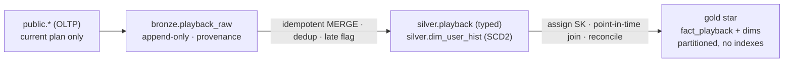
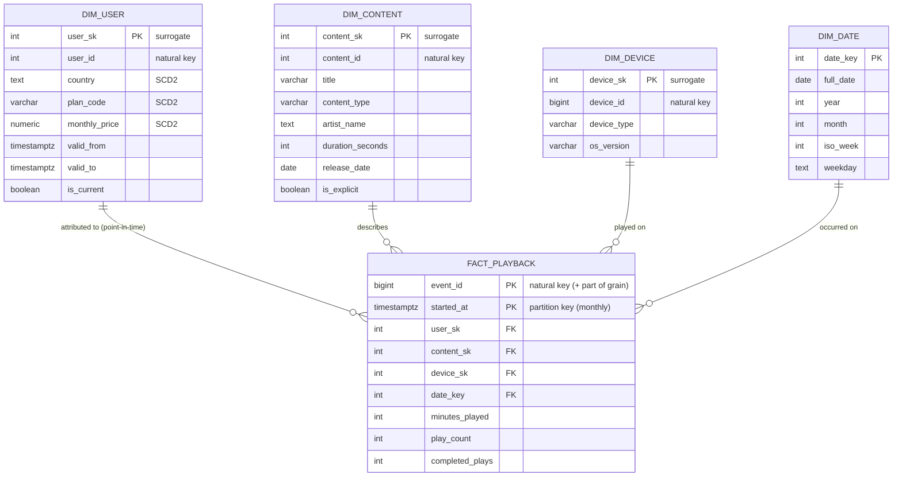

# SonicWave Analytics Platform

## The question

For each plan tier, how much do users actually listen while they're on
that tier — and which paying users look like they're drifting toward churn
because their listening keeps dropping?

## Why this exists

Right now product, marketing and finance all query SonicWave's live app
database directly. It's slow (their big aggregations fight the app for
resources), and worse, it's *wrong over time* — the OLTP database only
knows each user's **current** plan, so a question like "how much did people
listen while on the Free tier?" silently counts last year's plays under
whatever tier the user happens to be on today.

This project builds the analytical layer that fixes both: raw events land
in **Bronze**, get cleaned and conformed in **Silver** (where we keep the
*history* of who was on which plan and when), and are modelled into a
**Gold** star that answers the business questions correctly, repeatably,
and fast.

## Architecture

Raw events land in **Bronze** (append-only, untouched), get typed,
deduplicated and historized in **Silver**, and are modelled into a
**Gold** star that answers the question with point-in-time correctness.
Full layer-by-layer detail in [`docs/02_model_diagram.md`](docs/02_model_diagram.md).

## The star schema

## How to run

Prerequisites: a PostgreSQL `sonicwave` database seeded from the course
`full_seed.sql` (the `public.*` OLTP tables). The scripts create the `bronze`,
`silver` and `gold` schemas; every DDL uses `CREATE TABLE IF NOT EXISTS`, so the
files are safe to re-run.

Run the core pipeline in order to build a populated, queryable star:

1. `bronze/01_bronze_landing.sql` — land raw events + provenance
2. `silver/01_silver_ddl.sql`, `silver/02_silver_load.sql`, `silver/03_dimensions.sql`
   — typed/deduped events + the SCD2 `dim_user_hist`
3. `gold/01_dims.sql`, `gold/02_facts.sql`, `gold/03_dim_load.sql`, `gold/04_fact_load.sql`
   — dimensions (with surrogate keys), the partitioned fact, and the
   point-in-time fact load

Then explore and validate:

4. `queries/01,02,03,05,06` — analytics (read-only; `06` also creates the OBT view)
5. `tests/01,02,03` — each returns 0 rows when the data is clean

Demos — run each top to bottom. They mutate `public.subscriptions` or inject a
late event and then tear it down, re-running `silver/03 → gold/03 → gold/04` at
their rebuild markers, so the data ends back at baseline:

- `gold/05_scd2_evolution.sql` — a plan change flows through the SCD2 dim and the fact
- `gold/06_refresh.sql` — a windowed refresh absorbs a late-arriving event
- `queries/04_point_in_time.sql` — point-in-time vs naive totals (constructs a change)
