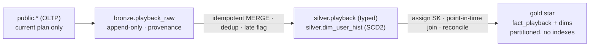
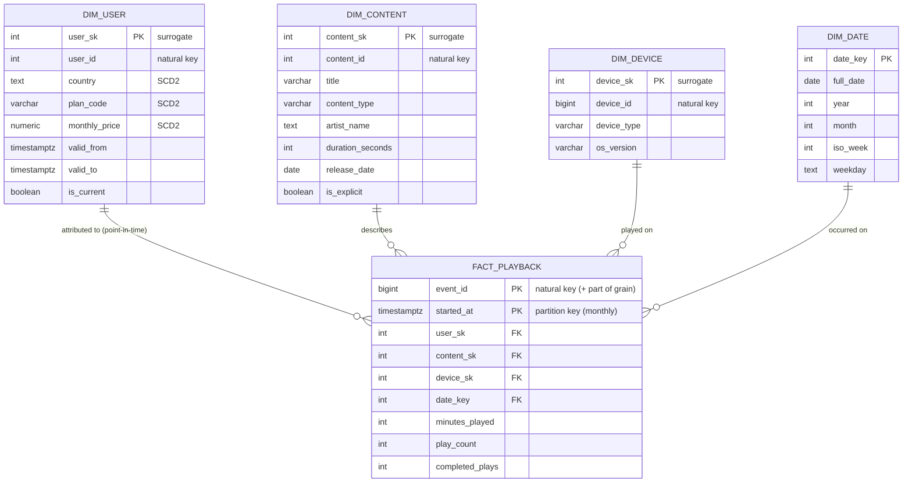

# SonicWave Analytics Platform

## The question

For each plan tier, how much do users actually listen while they're on
that tier — and which paying users look like they're drifting toward churn
because their listening keeps dropping?

## Why this exists

Right now product, marketing and finance all query SonicWave's live app
database directly. It's slow (their big aggregations fight the app for
resources), and worse, it's *wrong over time* — the OLTP database only
knows each user's **current** plan, so a question like "how much did people
listen while on the Free tier?" silently counts last year's plays under
whatever tier the user happens to be on today.

This project builds the analytical layer that fixes both: raw events land
in **Bronze**, get cleaned and conformed in **Silver** (where we keep the
*history* of who was on which plan and when), and are modelled into a
**Gold** star that answers the business questions correctly, repeatably,
and fast.

## Architecture

Raw events land in **Bronze** (append-only, untouched), get typed,
deduplicated and historized in **Silver**, and are modelled into a
**Gold** star that answers the question with point-in-time correctness.
Full layer-by-layer detail in [`docs/02_model_diagram.md`](docs/02_model_diagram.md).

## The star schema

## How to run

#TODO
