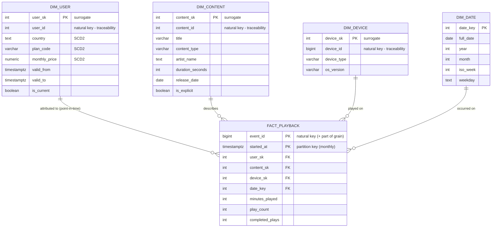
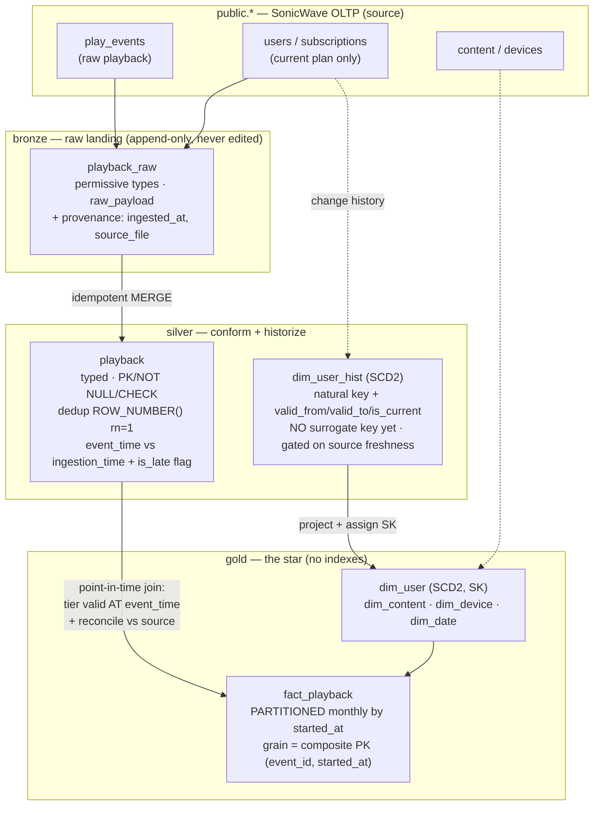

# Model Diagrams

## Star schema (Mermaid)

## Bronze -> Silver -> Gold flow

### What each layer does to the data

**Bronze** `playback_raw` | Lands the raw event stream append-only with permissive types so malformed rows land instead of erroring; adds provenance (`ingested_at`, `source_file`, `raw_payload`). Never cleans, types, dedups, or edits. The immutable record of "what arrived". 
**Silver** `playback` | Casts to real types with PK/NOT NULL/CHECK, idempotent `MERGE` from Bronze, dedups with `ROW_NUMBER() … rn=1`, separates `event_time` from `ingestion_time` and flags late-arriving rows. No surrogate keys, no star shape.
**Silver** `dim_user_hist` | Historizes the dimension as **SCD2** (natural key + `valid_from`/`valid_to`/`is_current`), gates out-of-order changes on a source freshness key, not arrival order. No surrogate key yet (that's Gold's job).
**Gold** dims | Project SCD2 dims from Silver and **assign surrogate keys**; build generated `dim_date` and current-state `dim_device` directly.
**Gold** `fact_playback` | Idempotent load that resolves each event to the dimension version **valid at event time** (three-predicate time-aware join), partitioned monthly by `started_at`, reconciles fact rows vs source, a windowed `DELETE`-then-`INSERT` refresh absorbs late data.
